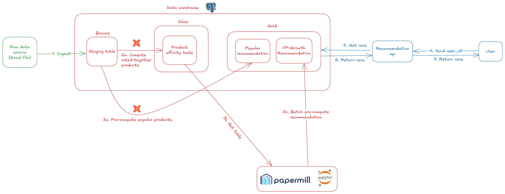

# Setup and Development Guide

Follow this guide to set up your development environment and run the application.

## High-Level Architecture Overview



This architecture illustrates a batch-driven recommendation workflow from raw data ingestion to end-user delivery:

**Data Ingestion and Staging**
Raw product interaction data arrives as Excel files and is first ingested into a staging table inside the data warehouse. This layer provides a clean, consistent source for downstream processing.

**Gold Layer – Core Feature Tables**
From the staging area, curated datasets are created, such as a product-affinity table capturing "bought-together" relationships. These gold tables serve as the foundation for building recommendation models and analytics.

**Mart Layer – Pre-Computed Recommendations**
Using the gold data, two main types of pre-computed outputs are produced:

- Popular recommendations (e.g., most frequently purchased items)
- FP-Growth association recommendations (frequent-pattern mining results)

Batch jobs populate these marts on a schedule so that recommendations are always ready for fast retrieval.

**Recommendation API and User Interaction**
When a user requests suggestions, the Recommendation API queries the mart tables to fetch the latest pre-computed results and returns personalized or popular recommendations back to the user in real time.


## Prerequisites

Before you begin, ensure you have the following tools installed:

- **Conda**: Package manager and environment management system (Anaconda or Miniconda)
- **Python 3.11.9**: Programming language and runtime (will be installed via conda)
- **pip**: Python package installer (comes with conda environments)
- **Make**: Build automation tool for running common development tasks
- **Docker & Docker Compose**: For containerized infrastructure services
- **Git**: Version control system

## Tool Introductions

This project leverages several modern development tools to enhance productivity and maintainability:

### Conda - Package and Environment Manager
**Conda** is an open-source package management system and environment management system that runs on Windows, macOS, and Linux. Key features include:
- Cross-platform package management
- Environment isolation with specific Python versions
- Dependency resolution and conflict management
- Support for both Python and non-Python packages

### Poe the Poet - Task Runner
**Poe the Poet** (poethepoet) is a task runner and build tool for Python projects. It provides a simple, standardized way to define and run project tasks. Key features:
- Task definitions in `pyproject.toml`
- Cross-platform script execution
- Environment variable support
- Task dependencies and composition

### DBT - Data Build Tool
**DBT (Data Build Tool)** is a command-line tool that enables data analysts and engineers to transform data in their warehouse more effectively. It brings software engineering practices to analytics:
- SQL-based transformations
- Version control for data models
- Automated testing and documentation
- Dependency management for data pipelines

### Make - Build Automation
**Make** is a classic build automation tool that helps organize and execute common development tasks. In this project, it's used for:
- Infrastructure management commands
- Simplified Docker operations
- Consistent development workflows

## Getting Started

### 1. Environment Configuration

Copy the example environment file and configure your settings:

```sh
cp .env.example .env
```

Edit the `.env` file to match your local configuration. This file contains database credentials, API keys, and other environment-specific settings.

### 2. Environment Variables Setup

Export the environment variables to make them available in your current shell session:

```sh
export PROJ_DIR=$(pwd)
echo "Project directory set to $PROJ_DIR"
set -a && source .env && set +a
```

This command:
- `set -a`: Automatically exports all variables that are assigned
- `source .env`: Loads variables from the .env file
- `set +a`: Disables automatic export for subsequent assignments

### 3. Dependency Installation

Create a conda environment with Python 3.13 and install project dependencies:

```sh
conda create --prefix ./venv python=3.13
conda activate ./venv
pip install -r requirements.txt
pip install -e .
```

**Command Explanations:**

1. **`conda create --prefix ./venv python=3.13`**: Creates a new conda environment in the local `./venv` directory with Python 3.13. The `--prefix` flag creates the environment in a specific location rather than the default conda environments folder.

2. **`conda activate ./venv`**: Activates the newly created conda environment. This ensures all subsequent Python and pip commands use the isolated environment.

3. **`pip install -r requirements.txt`**: Installs all project dependencies listed in the requirements.txt file. This includes all the necessary Python packages for the project to run.

4. **`pip install -e .`**: Installs the current project package (`fswe`) in editable mode. The `-e` flag creates a development installation where changes to the source code are immediately reflected without needing to reinstall the package.

You should see output indicating successful installation of packages.


This will create an isolated conda environment with the specified Python version, install all required dependencies, and install the current package in editable mode.

**Note**: If you want to use the `poe` task runner commands, you'll also need to install poethepoet:

```sh
pip install poethepoet
```

### 4. Infrastructure Services

Start the required infrastructure services (PostgreSQL, etc.) using Docker Compose:

```sh
make infra-up
```

This command launches all containerized services defined in the docker-compose files.

### 5. Monitor Infrastructure

View real-time logs from all infrastructure services:

```sh
make infra-logs
```

Use this to troubleshoot any issues with the containerized services.

### 6. Data Ingestion Pipeline

Execute the raw data ingestion pipeline using **Poe the Poet** (a task runner for Python projects that provides a simple way to define and run project tasks):

```sh
poe ingest-raw-data
```

**Poe the Poet** reads task definitions from `pyproject.toml` and provides a consistent interface for running complex commands.

### 7. DBT Profile Configuration

**DBT (Data Build Tool)** is used for data transformation and analytics engineering. Set up the DBT profile by creating a `profiles.yml` file:

```sh
(
cd fswe_demo/infra/dbt/ecommerce &&
cat <<EOF > profiles.yml
ecommerce:
  outputs:
    dev:
      dbname: $POSTGRES_DB
      host: $POSTGRES_HOST
      pass: $POSTGRES_PASSWORD
      port: $POSTGRES_PORT
      schema: public
      threads: 1
      type: postgres
      user: $POSTGRES_USER
  target: dev
EOF
)
```

This configuration tells DBT how to connect to your PostgreSQL database for data transformations.
> Tips: Follow [best practices](https://docs.getdbt.com/best-practices) on how to structure and write DBT projects.

After that, check the DBT connection:

```sh
(cd fswe_demo/infra/dbt/ecommerce && dbt debug --profiles-dir .)
```
If `All checks passed!` is shown, the connection is successful.

Then, install DBT dependencies:

```sh
(cd fswe_demo/infra/dbt/ecommerce && dbt deps --profiles-dir .)
```

### 8. Build DBT Models

```sh
(cd fswe_demo/infra/dbt/ecommerce && dbt build --select staging.ecommerce+ intermediate.product_affinity+ mart+ --profiles-dir .)
```

This command will execute the DBT models defined in your project.

You should see output indicating the progress of model building.


### 9 (Optional). View DBT Documentation
Generate and serve DBT documentation to explore your data models:

```sh
(cd fswe_demo/infra/dbt/ecommerce && dbt docs generate --profiles-dir .)
(cd fswe_demo/infra/dbt/ecommerce && dbt docs serve --profiles-dir . --port 8051)
```

Visit `http://localhost:8051` in your web browser to view the documentation.


### 10. Generate FP-Growth Recommendations

Run the notebook `002_fp_growth.ipynb` to generate FP-Growth recommendations and store them in the database. You can execute this notebook in two ways:

**Option 1: Interactive Notebook (Recommended for exploration)**
Open the notebook in Jupyter Lab or VS Code and run cells interactively:

```sh
# If using Jupyter Lab
jupyter lab notebooks/002_fp_growth.ipynb

# Or if using VS Code, simply open the file in the editor
```

**Option 2: Command Line Execution with Papermill**

**Papermill** is a tool for parameterizing, executing, and analyzing Jupyter notebooks. It's particularly useful for:
- Automated notebook execution in CI/CD pipelines
- Batch processing with different parameters
- Production notebook workflows
- Generating reports programmatically

Install papermill and execute the notebook:

```sh
pip install papermill
papermill notebooks/002_fp_growth.ipynb notebooks/outputs/002_fp_growth_output.ipynb
```

**Papermill Advanced Usage:**
You can also pass parameters to customize the notebook execution:

```sh
# Example with parameters (if the notebook supports them)
papermill notebooks/002_fp_growth.ipynb notebooks/outputs/002_fp_growth_output.ipynb \
  -p min_support 0.01 \
  -p min_confidence 0.5
```

> **💡 Tips for Exploration:**
> - Start with the interactive notebook to understand the FP-Growth algorithm implementation
> - Experiment with different support and confidence thresholds
> - Analyze the generated association rules and their business implications
> - Use papermill for automated runs once you've fine-tuned parameters
> - Check the output notebook generated by papermill for execution logs and results

### 11. Run the Application
Start the FastAPI application:

```sh
uvicorn fswe_demo.main:app --host 0.0.0.0 --port 8000
```

The application will be available at `http://localhost:8000`. You can access the interactive API documentation at `http://localhost:8000/docs`.

### API Sequence Diagrams

The following sequence diagrams illustrate how the recommendation APIs work internally:

### Popular Items API Flow


This diagram shows the flow when a user requests popular item recommendations. The API queries the pre-computed popular items from the mart layer and returns the results.

### FP-Growth Recommendations API Flow


This diagram illustrates the flow for FP-Growth association rule recommendations. The API retrieves pre-computed association rules from the mart layer based on user input and returns personalized recommendations.